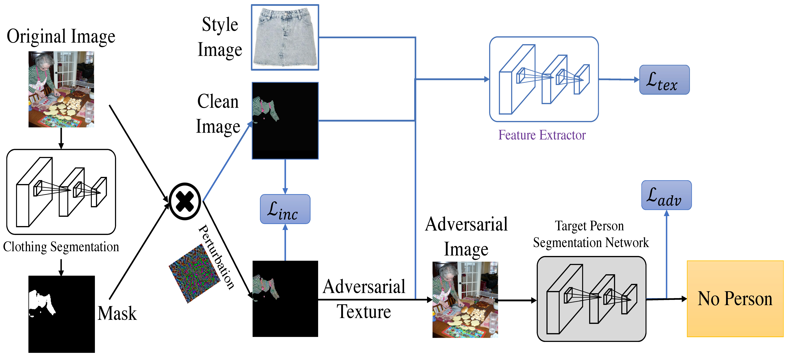
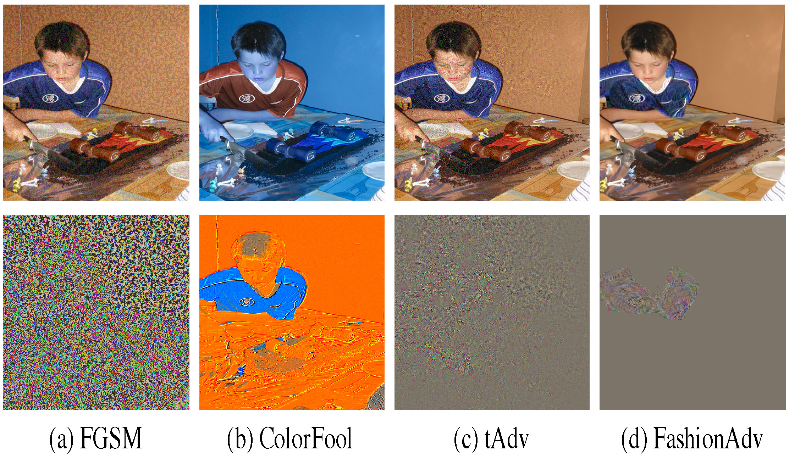

FashionAdv: Fashion-Guided Adversarial Attack
==================================



## Setup

To reproduce the paper results you will need to download few things.

#### The weight for yolact 
  - Can be found here: https://drive.google.com/uc?id=1UYy3dMapbH1BnmtZU4WH1zbYgOzzHHf_&export=download


#### The COCO 2017 validation dataset.

  - wget http://images.cocodataset.org/zips/val2017.zip -O ./data/val2017.zip
  - unzip data/val2017.zip
  - rm data/val2017.zip

  - wget http://images.cocodataset.org/annotations/annotations_trainval2017.zip -O ./data2/annotations_trainval2017.zip
  - unzip data/annotations_trainval2017.zip
  - rm data/annotations_trainval2017.zip

#### Pre-computed data

  - unzip data/Archive.zip

## Execute the attack

Path for data is given in the configuration.json file.

To Execute the attack you can use:

>python3 run_fashionAdv_attack.py

It will run FashionAdv on same setup and dataset as in the paper.

You can modify value in the configuration.json file.

You can also run the code on a smaller part on the dataset by given 2 argument to the script

FashionAdv_attack.py id_first_image id_last_image

>python3 run_fashionAdv_attack.py 0 100

## Evaluate the attack

>python3 evaluate_fashionAdv_attack.py 0 100



## Citations
Please consider citing this project in your publications if it helps your research:

```
@Inproceedings{marc-CVPRW2021,
  Title          = {Fashion-Guided Adversarial Attack on Person Segmentation},
  Author         = {Marc Treu and Trung-Nghia Le and Huy H. Nguyen and Junichi Yamagishi and Isao Echizen},
  BookTitle      = {Conference on Computer Vision and Pattern Recognition Workshops},
  Year           = {2021},
}
```


## License

The code is used for academic purpose only.


## Contact

[Marc Treu](https://github.com/marc-treu),
[Trung-Nghia Le](https://sites.google.com/view/ltnghia/research/FashionAdv).
 

